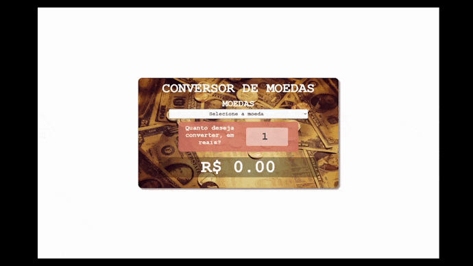
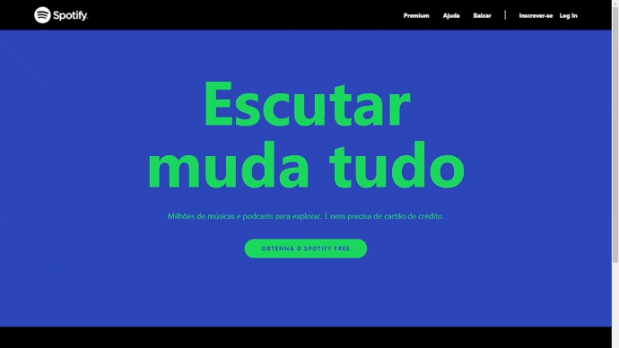
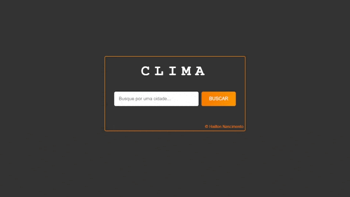

  

<h1 align="center">
 <a href="https://hailton-nascimento.github.io/" target="_blank" rel="noopener noreferrer">Demo</a>
</h1>

# Pagina_Pessoal

Página pessoal com os projetos que desenvolvi ao longo da jornada de prendizado para divulgação pessoal.

## Projetos

  

## Jogo Da Memória

<h3>Nesse projeto, o desafio foi criar um jogo da memória utilizando apenas HTML, CSS e Javascript, trabalhando com efeitos 3D no CSS e lógica de programação, manipulação do DOM e de Array, um projeto super divertido, com muita
versatilidade, sendo possível alterar quantidade de cartas e a temática das imagens. Desenvolvido para Aprendizado e aprimoramento de Javascript.
</h3>

 

## Jogo da Velha

<h3>Projeto muito desafiador, com logicas bastante complexas, foi desenvolvido em HTML, CSS, Javascript. O modulo de jogador autônomo precisou de uma atenção especial para ser desenvolvido. Os pontos são salvos no banco de dados
do Browser (localStorage).</h3>

 

## Amazon Clone

<h3>
Clone da página Oficial da Amazon, utilizando o Framework Tailwind para praticar a utilização do mesmo no desenvolvimento de Layout responsivo.
</h3>

 

## Nascimento Host

<h3>
Projeto criado para oferecer hospedagem de páginas Web e domínios de sites, com um layout básico utilizando Html e CSS para aprendizado e aperfeiçoamento no desenvolvimento de Layout totalmente responsivo.
</h3>

 

## Conversor de Moedas

<h3>Cotação e Conversor de moedas em reais. A aplicação que consulte através de uma api externa a última cotação da moeda desejada e faz a conversar para reais. Projeto desenvolvido para aprendizado de HTML5, CSS, JavaScript, proposto
em uma imersão Dev da plataforma alura.</h3>

 

## Urna Eletrônica

<h3>Projeto desenvolvido para aprendizado de Html, Css, Javascript, foi proposto pelo perfil no youtube Bonieky Lacerda. A aplicação e um simulador funcional da Urna Eletrônica Brasileira, com todas as funcionalidades. Com simulação
de Voto NULO, BRANCO, voto na Legenda, no vereador, prefeito com seu vice-prefeito.
</h3>

 

## Spotify Clone

<h3>Clone da página do Oficial do Spotify, utilizando o Framework Tailwind para praticar a utilização do mesmo no desenvolvimento de Layout responsivo, já que é uma das premissas do Tailwindcss.</h3>

 

## Doceria Ana Maria

<h3>
    Página fictícia de uma doceria, projeto desenvolvido em Html e Css para aprendizado e aperfeiçoamento de desenvolvimento de Layout básico de uma página institucional.
</h3>

 

## Clima Tempo

<h3>Projeto simples de consulta de previsão do tempo para uma localidade na data atual. Projeto desenvolvido com JavaScript, HTML e CSS para aprendizado de fetch() e chamada await(), utilizando api.</h3>

 

                                                    
## Whatsapp Web Clone

<h3>
Clone página do WhatsApp Web, com um layout básico utilizando Html e CSS para aprendizado e aperfeiçoamento no desenvolvimento de Layout.
</h3>

